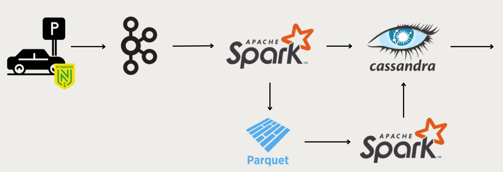

# ARCHIBIGD-B

Lien API : https://data.nantesmetropole.fr/api/explore/v2.1/catalog/datasets/244400404_parkings-publics-nantes-disponibilites/records?limit=-1

Lien global du data set : https://data.nantesmetropole.fr/explore/dataset/244400404_parkings-publics-nantes-disponibilites/information/?disjunctive.grp_nom&disjunctive.grp_statut&sort=-grp_complet

# Comment ça marche ?

Après avoir lancé les différents conteneurs, la récupération des données se fait vient le fichier **producer/app/producer.py**. Ce fichier crée un topic Kafka (si n'existe pas déjà) appelé parking et va stocker les données envoyées par l'API directement dans le topic sous forme de message (format json). Ensuite, en lançant le fichier **kappa/apps/processing.py** depuis le terminal bash du spark master (possibilité d'utiliser bash processing.sh), on aura 2 traitements en parallèle :
- un traitement en flux continu qui stock dans la table projet.parking_data Cassandra (lancer le fichier **create_table.py** au préalable si la table n'a pas été crée)
- un stockage des données dans des parquets pour un futur traitement en batch (les parquets sont accessibles dans **kappa/apps/parquet_data_file/heure=X/jour=Y**
Ceci se fait lorsque que de nouveaux messages sont écrits dans le topic parking (donc **producer.py** doit tourner en parallèle pour alimenter ces tables / fichiers parquet).

Le traitement en batch se fait dans **kappa/apps/batch_processing.py** (possibilité de le lancer avec bash batch_processing.sh) : les données sont récupérées depuis les parquets et groupées par (id, heure, jour) et faisant une moyenne des places disponibles pour de futurs visualisation. Quelques idées de visualisation sont implémentés dans le fichier **kappa/apps/visu.ipynb**.

# Architecture globale

